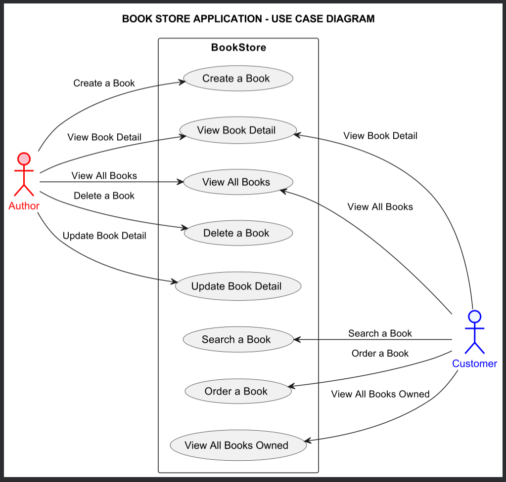

# Book Store Application built with Java

## Project Overview

In this project, I built a Java-based Bookstore Application to manage books and orders. Authors can create, view,
update, and delete books, while customers can browse and purchase them. The application uses a layered architecture for
robustness, maintainability, and scalability. Key features include book management, order processing, and data
persistence with serialization.

I created this application as a proof-of-concept project to practice and showcase my skills in Java programming,
object-oriented
design, and software architecture. It demonstrates my ability to build scalable applications, implement data
persistence, and manage complex system interactions.

## My skills through completing the project

* Java programming: Built a comprehensive backend.
* Object-oriented design: Applied best practices and the Adapter design pattern.[[1]](#1)
* Layered Architecture: Ensured clear separation of concerns.[[2]](#2)
* Data Persistence: Implemented robust serialization.[[3]](#3)
* System management: Managed complex component interactions.

## Architecture Overview

### Layered Architecture Diagram


The Bookstore Application follows a layered architecture to separate concerns and enhance maintainability. The
architecture consists of the following layers:

1. **Client Layer** (i.e. Presentation Layer): This layer handles user interactions.
2. **Controller Layer**: Manages client interactions and handles user inputs and outputs.
3. **Service Layer** : Contains business logic and validation rules.
4. **Repository Layer** (i.e. Persistence Layer): Handles database-related operations.
5. **Entities**: Represents the data structures (data models).
6. **Serialization Layer**: Manages serialization and deserialization of objects for data persistence. This layer helps
   to convert objects to a savable format.
7. **Storage Layer** (i.e. Database Layer): Serves as physical storage of serialized objects, e.g. `BookEntity`.

### Use Case Diagram



The use case diagram for the Bookstore Application shows the interactions between the system and its two primary
users: Authors and Customers. Authors can create, view, update, delete, and search for books, allowing them to manage
their entire catalog. Customers can view all books, search for specific titles, place orders, and view their purchased
books. This diagram also shows the functionality provided to both types of users.

### UML Diagram


### Sequence Diagram


The sequence diagram below illustrates the interaction between Java classes and their methods for processing a book
order:

1. `BookController`: Handles user requests and has methods like `add` and `getBook`.
2. `BookService`: Manages business logic, including converting DTOs to entities and vice versa.
3. `BookRepository`: Communicates with the database and handles CRUD operations.
4. `BookSerializer`: Manages serialization and deserialization of `BookEntity` objects.

**Order Processing Steps:**

1. `BookController` initiates the order process by calling `BookService.add`.
2. `BookService` converts `BookDTO` to `BookEntity` and calls `BookRepository.add`.
3. `BookRepository` serializes the `BookEntity` and saves it to a file.
4. To retrieve a book, `BookController` calls `BookService.getBook`.
5. `BookService` calls `BookRepository.getDetail` to deserialize the `BookEntity` from the file and convert it back to
   `BookDTO`.

## Technology Stack

### Backend

* Java: The core programming language used for development.
* Serialization: For data persistence and retrieval.

### Frontend

(Currently, there is no frontend implementation. This can be added using technologies like Angular, React, or any other
frontend framework.)

### Server/Database

* Temporary Storage: Uses Java Collections for temporary storage of book data.
* Serialization: Implements serialization and deserialization for data persistence.

## Installation

Follow these detailed setup instructions to get the application running on your local machine.

### Backend setup

#### 1. Clone the Repository:

```bash
git clone https://github.com/your-username/bookstore-application.git
cd bookstore-application
```

#### 2. Set Up Your Development Environment:

* Ensure you have Java JDK installed (version 8 or above).
* Use an IDE like IntelliJ IDEA or Eclipse.

#### 3. Compile the Project:

* Open the project in your IDE.
* Build the project to ensure all dependencies are correctly resolved.

#### 4. Run the Application:

* Run the BookClient class to test the functionality.

### Environment Setup

* Java JDK: Install Java Development Kit (JDK) version 8 or above.
* IDE: Use IntelliJ IDEA, Eclipse, or any other Java IDE for development.

## Usage

### 1. Running the Application:

Execute the main method in the `BookClient` class.
The BookClient will simulate adding a book and retrieving its details, showcasing the application's core functionality.

### 2. Interacting with the Application:

Use the `BookController` to manage books and interact with the `BookService` layer.
The `BookService` layer handles business logic and interacts with the `BookRepository` for data persistence.

<!--
## Tests (optional)

### 1. Unit Tests:

Use JUnit to write and run unit tests for your application.
Ensure all tests pass to verify the correctness of your code.

### 2. Integration Tests:

Write integration tests to ensure different parts of the application work together as expected.

### 3. Executing Tests:

In your IDE, right-click on the test class or method and select 'Run' to execute the tests.
Alternatively, use build tools like Maven or Gradle to run tests from the command line.

```bash
# Example for Maven
mvn test
```
-->

## References

<a id="1">[1]</a> S. Metsker and W. C. Wake, "Chapter 3. Adapter," in Design Patterns in Java. Pearson Education, 2006. [Online].
Available: https://books.google.ca/books?id=S5ebGvuLJqQC&pg=PA17. [Accessed: Jun. 23, 2024].

<a id="2">[2]</a> M. Richards, "Chapter 1. Layered Architecture," in Software Architecture Patterns, O’Reilly Online
Learning. [Online].
Available: https://www.oreilly.com/library/view/software-architecture-patterns/9781491971437/ch01.html. [Accessed: Jun. 23, 2024].

<a id="3">[3]</a> "Introduction to Java Serialization," Baeldung, May 15, 2017. [Online].
Available: https://www.baeldung.com/java-serialization. [Accessed: Jun. 23, 2024].


